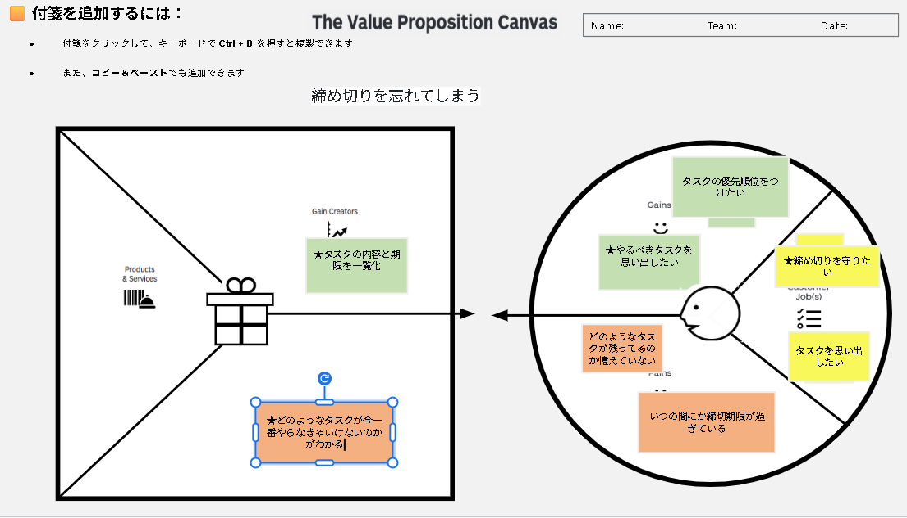

# VPC v1 - lemon___senpai

> 「**自分や周りの人を顧客に設定**」したVPC。13週後の自分が欲しいもの・身近な人のために作りたいものを設計する。
> v1 でいい。完璧を目指さない。第6回でアップデート(v2)します。

---

## 1. 解決したい困りごとを 1つ 選ぶ

> [`bug-list.md`](./bug-list.md) の20個から、**「自分が一番これを解決したい!」と思うもの** を1つ選んでください。
> 1つに絞れなければ、複数候補を書いてOK(後で絞り込みます)。

**選んだ困りごと**:

1. 締め切りを忘れてしまう

---

## 2. その解決策のアイデアを書く

> 選んだ困りごとに対する「**こうだったらいいのに**」を1つ書く。
> 現実性は気にせず、自由に発想。

**解決のアイデア**:

タスクの内容や締め切り期限をすべて一元管理し、今「何をやればいいのか」「どのタスクの優先度が高いのか」がリアルタイムで一目でわかる、自動通知機能付きのタスク管理アプリ。

---

## 3. VPC本体

> 上で選んだ「困りごと」と「解決のアイデア」を起点に、6要素を埋めていきます。

### 🟦 Customer Profile(顧客=自分自身)

#### Jobs(やりたいこと・動詞で書く)

- ★ 締め切りを守りたい
- タスクを思い出したい

#### Pains(困っていること)

- どのようなタスクが残っているのか覚えていない
- いつの間にか締切期限が過ぎている

#### Gains(得たい未来・状態)

- タスクの優先順位をつけたい
- ★ やるべきタスクを思い出したい

---

### 🟧 Value Map(あなたが作るもの)

#### Products & Services

- タスク期限一元化・優先度可視化アプリ（仮）

#### Pain Relievers

- ★ どのようなタスクが今一番やらなきゃいけないのかがわかる

#### Gain Creators

- ★ タスクの内容と期限を一元化

---

## 4. Fit確認(整合チェック)

| Pains/Gains | ↔ | Pain Relievers / Gain Creators | チェック |
|---|---|---|---|
| いつの間にか締切期限が過ぎている / どのようなタスクが残っているのか覚えていない | ↔ | ★ タスクの内容と期限を一元化 | ✓ |
| ★ 締め切りを守りたい / ★ やるべきタスクを思い出したい | ↔ | ★ どのようなタスクが今一番やらなきゃいけないのかがわかる | ✓ |

> 整合しないものは「自分が作りたいだけ」のプロダクトになりがち。
> 迷ったら AI大学講師に壁打ち。

